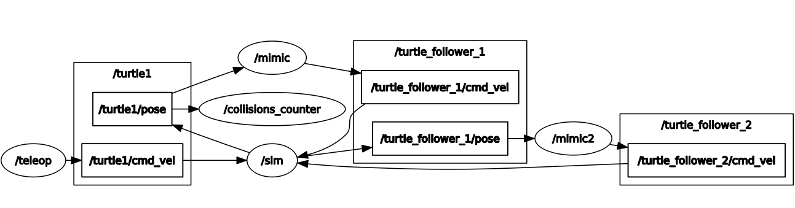

follower3
=========

Package to spawn 3 turtles; a turtle can be controlled, the remaining turtles will be followers.
In addition, there is a counter of the number of collisions.

Instructions
------------
Follow the next steps to start the follower
1. Go to your workspace 
    ```
    cd ~/catkin_ws/src
    ```
2. Clone the project
    ```
    git clone git@github.com:soyantonio/follower3.git
    ```
3. Build the source code
   ```
   cd ~/catkin_ws && catkin_make
   ```
4. Run the program
   ```
   roslaunch follower3 followers.launch
   ```

Collisions
----------

Run `rostopic echo /turtle1/collision`

Diagrams
-------
Topics and nodes


Useful Resources
----------------
- [ROS + PyCharm](https://www.youtube.com/watch?v=lTew9mbXrAs)
